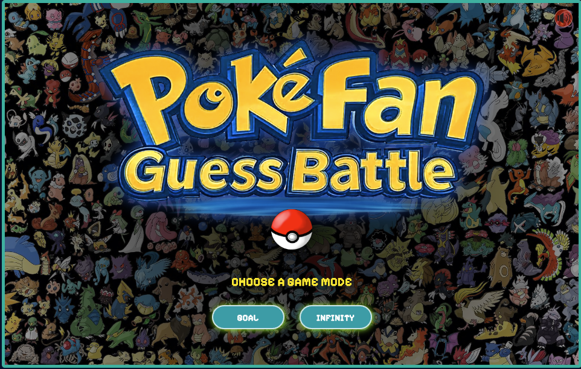

# PokéFan Battle Game v1.0

Welcome to **PokéFan Battle Game**, a web-based game inspired by the classic PokéFan universe! This game offers an engaging experience where players can challenge a CPU opponent in a strategic battle, choosing between different game modes and difficulty levels. With a retro pixel-art style, immersive sound effects, and dynamic animations, this game brings the thrill of PokéFan battles to your browser.


Enjoy this Game! 
https://hao-317.github.io/PokeFanBattle/

## Table of Contents
- [Game Overview](#game-overview)
- [Features](#features)
- [How to Play](#how-to-play)
- [Installation and Setup](#installation-and-setup)
- [Deployment on GitHub Pages](#deployment-on-github-pages)
- [Technologies Used](#technologies-used)
- [Contributing](#contributing)
- [License](#license)

## Game Overview
PokéFan Battle Game is a single-player game where you face off against a CPU opponent in a turn-based battle. Choose your PokéFan-inspired moves (represented as objects A, B, C, and a special object D) to outsmart the CPU. The game offers two modes: **Goal Mode** (win a set number of rounds) and **Infinity Mode** (survive as long as possible). With customizable difficulty levels and a points system, you can test your skills and aim for a high score!

The game features a nostalgic PokéFan theme with a stadium background, animated effects, and soundtracks that enhance the battle atmosphere.

## Features
- **Two Game Modes**:
  - **Goal Mode**: Win a specific number of rounds (3, 5, 7, or 10) to claim victory.
  - **Infinity Mode**: Survive as long as possible, earning extra lives as you progress.
- **Difficulty Levels**: Choose between Normal and Hard modes to adjust the challenge.
- **Dynamic Animations**: Enjoy visual effects like electric sparks, life-gain animations, and a special "Object D" popup.
- **Sound Effects and Music**: Immersive audio with opening, battle, and end themes, plus sound effects for actions like winning, losing, or selecting moves.
- **Points System**: Earn points based on your performance, with bonuses for Hard mode and Infinity mode milestones.
- **High Score Tracking**: Compete with yourself by setting new high scores in Infinity mode.
- **Exit Option**: Pause and exit the game at any time during a match, returning to the start screen.

## How to Play
1. **Start Screen**:
   - Choose a game mode: **Goal Mode** or **Infinity Mode**.
   - In Goal Mode, select your target number of wins (3, 5, 7, or 10).
   - In Infinity Mode, aim to survive as long as possible.
   - Select a difficulty: **Normal** or **Hard**.
   - Click "Start" to begin the battle.

2. **Game Screen**:
   - Choose your move by clicking one of the three buttons (Object A, B, or C).
   - The CPU will respond with its own move.
   - The winner of each round is determined by a rock-paper-scissors-like mechanic:
     - Object A beats Object B.
     - Object B beats Object C.
     - Object C beats Object A.
   - In Infinity Mode, a special "Object D" may appear after reaching certain milestones, guaranteeing a win for that round.
   - Monitor your lives (in Infinity Mode) or scores (in Goal Mode) to track progress.
   - Use the "Exit ⏏️" button in the top-right corner to pause and exit the game if needed.

3. **End Screen**:
   - View your final score and earned points.
   - In Infinity Mode, check if you've set a new high score.
   - Click "Restart" to return to the start screen and play again.

## Installation and Setup
To run the game locally on your machine, follow these steps:

1. **Clone the Repository**:
   ```bash
   git clone https://github.com/HAO-317/PokeFanBattle.git


## License
This project is licensed under the MIT License. See the [LICENSE](LICENSE) file for details.

## Copyright
© 2025 [HAO LI / HAO317]. All rights reserved.   